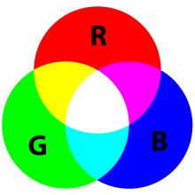

## Playing with images in R: setting the stage

A library is a collection of code written and shared by others that makes our life easier because we don't have to start from scratch when writing our programs. The R library we will use to play with images is called imageR. 

Let's load it into our workspace:

```{r}
library(imager)
```

Let's also load a JPG image file into our R environment:

```{r}
# Load the picture
photo <- load.image("../average-color-photos/2.jpg")

# Preview the picture loaded
plot(photo)
```

What do the axes represent here? 

## Wait, how does the computer understand color?

All the colors of the rainbow can be obtained as combinations of 3 basic colors: red, green, and blue. Different amounts of each of these three colors can give you all the others. 



### How imageR stores images

The imager library represents images as 4-dimensional arrays of numbers. The four dimensions are labelled x,y,z,c. The first two are the usual x and y spatial dimensions, the third one corresponds to time (only relevant if you have a video), and the fourth one is colour. 

The function `dim()` tells us the number of elements in each of the four dimensions of the image object we named `photo`.  

```{r}
dim(photo)
```

#### Wait, what do these numbers mean? 

The image we loaded is 120 pixels wide (in the x dimension) and 90 pixels long (in the y dimension). It isn't a video, so it makes sense that it only has 1 frame in the z-dimension, and it is in color, so it has the 3 color channels (red, green and blue, together called RGB) that can combine to make all the possible colors of the rainbow. 

## Let's extract the colors for all the pixels of our image

```{r}
# Separate out the color values using the function imsplit() that comes in imageR 
colorsRGB = imsplit(photo,"c") # the arguments here specify to use the image we named "photo" and to separate out the "c" dimension then save it in a variable we decided to call "colors"

# Are you curious to see what the separated red, green and blue looks like? 
plot(colorsRGB)
```

### Does this make sense? 

Which parts of the image would you expect would have more red in them? The seaweed in the bottom left. Indeed, the **red channel**, as we can see in the plot for c = 1 has higher values (lighter color) where there is seaweed, and very low values (almost black) where there is blue water in the background. 

The **blue channel**, as you can see in the plot for c = 3 has higher values for the pixels of the sea water, in the top right hand corner of the image. 

The dark spot in the middle of the rocks has low values (darker) in **all three channels**: c = 1, c = 2 and c = 3. 

## What is the average color in each of the channels? 

The colorsRGB object is made up of three lists. One list for the red channel, one for the green and one for the blue. 

In the code block below, will use the function laply() to take the mean of each of the three lists.

```{r}
# Get the mean from each list: red, green, blue
averageRGB <- colorsRGB %>% laply(mean)
averageRGB     
```

### Convert the floating point averages to a meaningful scale 

Because the color is represented as a number called a "floating point", its value has been normalized to be between 0 and 1. We can convert this to values that will be meaningful when we draw the color later by multiplying it by 255.

### Why 255, I hear you ask? 

The people who wrote the imfill() function which we will use later to plot the average color, use values of integers from 0 to 255 to represent how much red, or green, or blue is contained in each shade of color. 

The range is restricted from 0 to 255 because the integers have to fit in the 8 bits (or positions) of memory that computers allocate for each of them. This has to do with the binary number system. Each of the 8 bits (or positions) can take the value of 0 or 1. 

The largest number that can be represented with 8 positions is the binary number 11111111 which is the decimal number 255. 

```{r}
# Multiply the averageRGB by 255
scaled_averageRGB <- averageRGB*255
scaled_averageRGB
```

## Draw an image filled with the average color 

Look up the help() page for the imfill() function. What are the arguments that it takes?

```{r}
# Draw a shade with the average RGB
imfill(20, 20, val = scaled_averageRGB) %>% plot
```

#### Woohoo!! That makes sense as the average color of an image of the ocean. 

#### Now you can go backwards to create a photo mosaic!

You can match the average color of this image to a single pixel from another image. If you then place the entire image of the ocean in place of that matching pixel in the other image, and you do the same thing for all the pixels of the other image, you'll have a photo mosaic.
